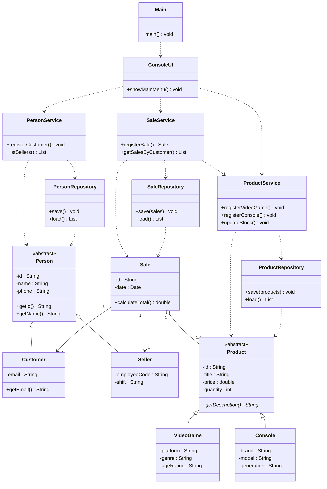

# classDiagram

```mermaid
classDiagram
    class Person {
        <<abstract>>
        -id : String
        -name : String
        -phone : String
        +getId() String
        +getName() String
    }
    class Customer {
        -email : String
        +getEmail() String
    }
    class Seller {
        -employeeCode : String
        -shift : String
    }
    class Product {
        <<abstract>>
        -id : String
        -title : String
        -price : double
        -quantity : int
        +getDescription()* String
    }
    class VideoGame {
        -platform : String
        -genre : String
        -ageRating : String
    }
    class Console {
        -brand : String
        -model : String
        -generation : String
    }
    class Sale {
        -id : String
        -date : Date
        +calculateTotal() double
    }
    class ProductRepository {
        +save(products) void
        +load() List
    }
    class PersonRepository {
        +save() void
        +load() List
    }
    class SaleRepository {
        +save(sales) void
        +load() List
    }
    class ProductService {
        +registerVideoGame() void
        +registerConsole() void
        +updateStock() void
    }
    class PersonService {
        +registerCustomer() void
        +listSellers() List
    }
    class SaleService {
        +registerSale() Sale
        +getSalesByCustomer() List
    }
    class ConsoleUI {
        +showMainMenu() void
    }
    class Main {
        +main() void
    }

    Person <|-- Customer
    Person <|-- Seller
    Product <|-- VideoGame
    Product <|-- Console

    Sale "1" --> "1" Customer
    Sale "1" --> "1" Seller
    Sale "1" o-- "1..*" Product

    ProductService ..> ProductRepository
    PersonService ..> PersonRepository
    SaleService ..> SaleRepository
    SaleService ..> ProductService

    ConsoleUI ..> ProductService
    ConsoleUI ..> PersonService
    ConsoleUI ..> SaleService

    ProductService ..> Product
    PersonService ..> Person
    SaleService ..> Sale

    ProductRepository ..> Product
    PersonRepository ..> Person
    SaleRepository ..> Sale

    Main ..> ConsoleUI
```