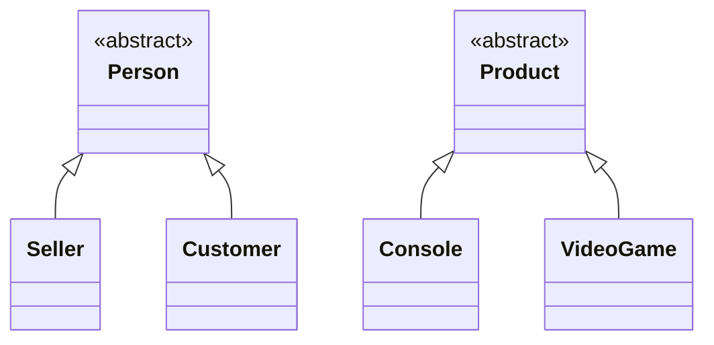

# Hierarchy diagram

```mermaid
classDiagram
    class Person {
        <<abstract>>
    }
    class Customer
    class Seller

    Person <|-- Seller 
    Person <|-- Customer 
    class Product {
        <<abstract>>
    }
    class VideoGame
    class Console

    Product <|-- Console 
    Product <|-- VideoGame 
```