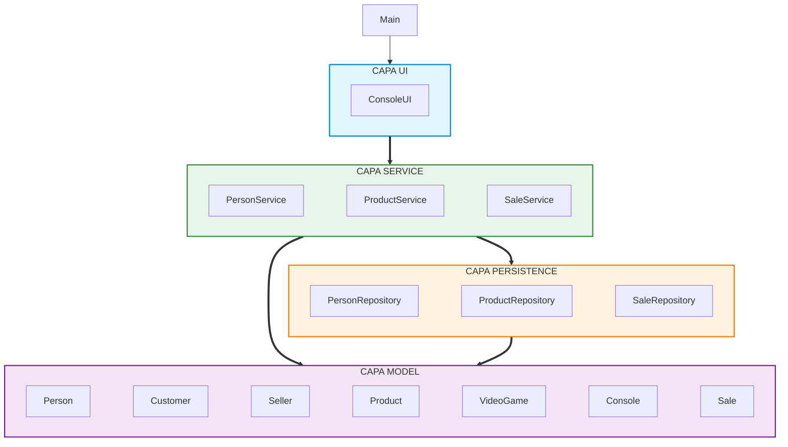

# Layers Diagram

```mermaid
graph TB
    Main["Main "] --> UI

    subgraph UI ["CAPA UI"]
        ConsoleUI["ConsoleUI"]
    end

    subgraph SERVICE ["CAPA SERVICE"]
        PersonService["PersonService"] ~~~ ProductService["ProductService"] ~~~ SaleService["SaleService"]
    end

    subgraph PERSISTENCE ["CAPA PERSISTENCE"]
        PersonRepository["PersonRepository"] ~~~ ProductRepository["ProductRepository"] ~~~ SaleRepository["SaleRepository"]
    end

    subgraph MODEL ["CAPA MODEL"]
        Person["Person"] ~~~ Customer["Customer"] ~~~ Seller["Seller"] ~~~ Product["Product"] ~~~ VideoGame["VideoGame"] ~~~ Console["Console"] ~~~ Sale["Sale"]
    end

    UI ==> SERVICE
    SERVICE ==> PERSISTENCE
    SERVICE ==> MODEL
    PERSISTENCE ==> MODEL

    style UI fill:#e1f5fe,stroke:#0288d1,stroke-width:2px
    style SERVICE fill:#e8f5e9,stroke:#388e3c,stroke-width:2px
    style PERSISTENCE fill:#fff3e0,stroke:#f57c00,stroke-width:2px
    style MODEL fill:#f3e5f5,stroke:#7b1fa2,stroke-width:2px
```